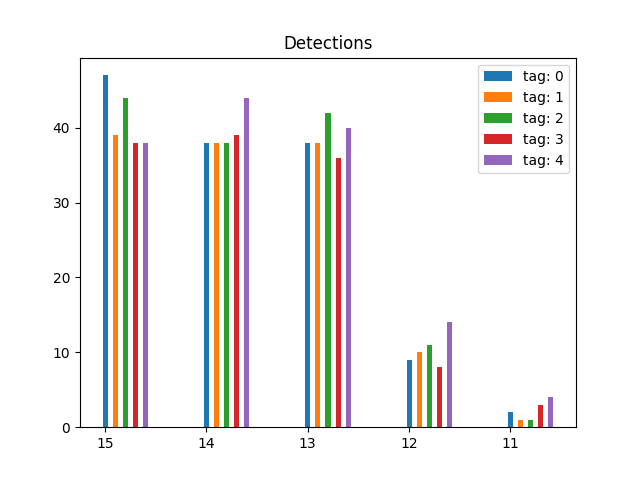
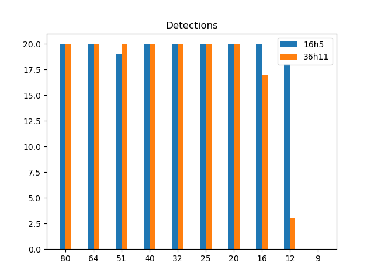
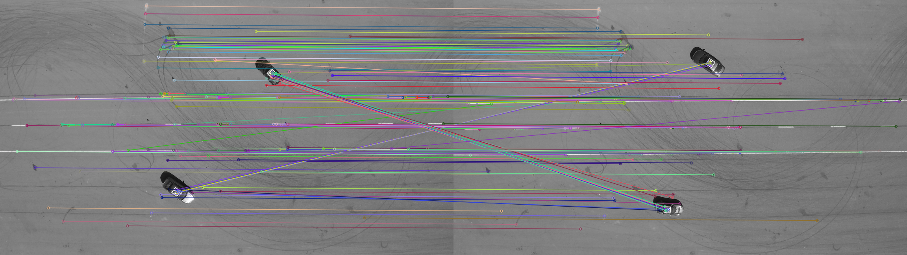

# TRI Drone Project, NAVLab

*Author: Torstein Ørbeck Eliassen*

## Introduction

The software in this repository processes drone images/ web cam images in order to obtain relative distance measurements.
Multiple approaches for detection have been investigated, such as apriltag detection, feature detection and color segmentation.

## Tracking videos

The following videos are tracked using 1 apriltag detection and then SIFT detection to generate the relative vector visualized below. 

*Flightroom tracking*

*Thunderhill tracking*

## Apriltag tag comparisons

*Tag family 16h5: Id comparison*

*Tag families at low resolution*

## SIFT detections

SIFT detect and match on arbitrary image: 

# Directories and associated files
/apriltag_scripts
    /compare_tags.py - checks whether tags can be detected at various scalings (unused)
    /gen_pattern.py - generates user-chosen geometric patterns (unused)
    /rand_locations.py - places AprilTags in a random spot on a chosen photo (unused)
    /single_image_detection.py - script for AprilTag detection in a selected image
    /tag_family_comparison.py - script for checking whether detected tags are correct (unused)
/apriltag_tools
    /Detector.py - class for detecting AprilTags in images
    /ImageParser.py - computes boundaries for window-parsing of input image
    /Measurement.py - class for storing AprilTag measurements, one Measurement per image
/cars
    /Car.py - class for car with AprilTag attached (unused)
    /relative_distances.py - calculates relative distance between vehicles (unused)
/color_segmentation
    /detect_cones.py - detects cones on road (unused)
/cv2_tools
    /cv2utils.py - includes tools for plotting AprilTags and manipulating images
    /jpeg_to_png.py - converts JPEG to PNG
    /mp4_selective_to_png.py - selects frames from an MP4 to convert to PNG
    /mp4_to_img.py - converts MP4 to multiple PNGs
/dynamics_models - unused
/flight_room_analysis - used for processing flight room drone videos
/hdmi_reading - reads frames from HDMI
/plotting
    /rel_dists.py - plots AprilTag relative distances
/rotations_2d
    /angle_between.py - determines relative angle between tags
/sift - tools for using SIFT 
/tracking_scripts - object tracking (TODO: flesh this out)
/tracking_tools
    /relative_distances.py - determines distances between tags 